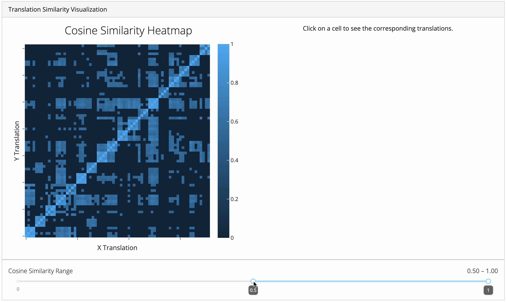
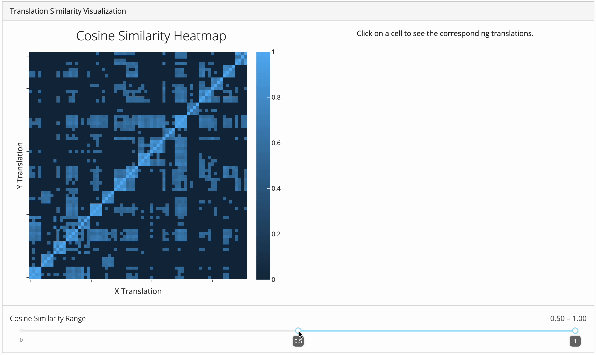

# Usage

[Install uv](https://docs.astral.sh/uv/getting-started/installation/)


Start the app
```
uv run python dash_app.py
```

# Demo

## Passage with high similarities across translations


## Passage with low similarities across translations

